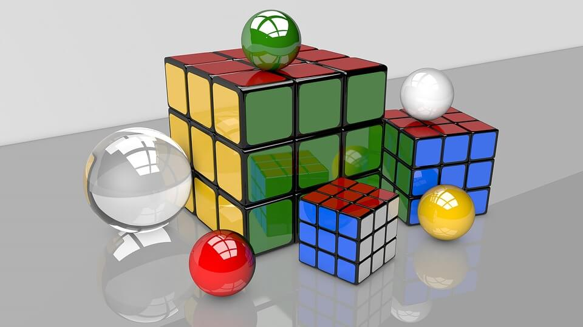
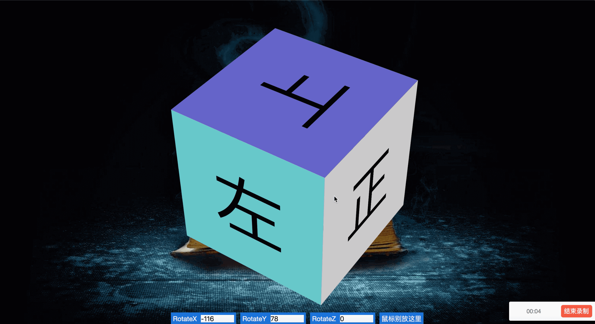

# Vue入门介绍

> 各位好，这是一份Vue2入门材料，如有勘误请直接提交issue。

## 学习目的

1. 了解Vue2的常见用法。

## 基本介绍

Vue是一个由***数据驱动视图***的库，与以前开发者直接通过操作DOM修改视图的开发方式差异较大——不仅是在代码的写法上，更是在编程思维上。

需要注意，Vue不支持IE8，支持IE9+。

Vue与React有很多相似点，但两者的HTML默认模版书写方式上有较大差异。

## 项目示例

详见demo目录中的代码。<del>Demo示意视频见attachment/demo.mp4文件。（视频一放，仓库下载速度实在感人，还是删了）</del>

Demo示意图如下：

通过该Demo，预期习得的核心知识点有：

1. 与React的componentDidMount、componentWillUnmount类似，Vue有对应的mounted、beforeDestroy等组件生命周期上的钩子。
2. 在Vue中，可通过@click、@mouseenter这样的属性来进行***事件绑定***。
3. Vue可以通过给input、textarea等表单元素添加v-model属性实现数据的双向绑定，在书写上比React方便很多。

## 写在最后

其实Vue的官方文档已经写得非常好了，甚至官网教材上还配了视频。
不管是Vue，还是其他什么框架、语言，最好的学习方式都是看官方文档。
文字信息在被翻译、重新组织的过程中，多少都会有些"失真"的。

## License

This repository is under the [MIT License](./LICENSE).
